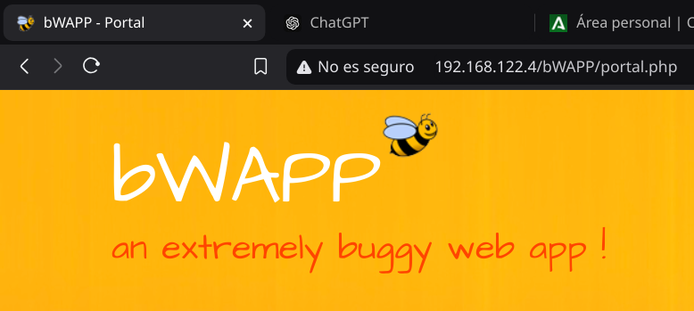

# Práctica 01: SQLi
## Preparativos
1. Kali Linx (como máquina virtual o huésped)
2. Máquina OWASP que hostea la web vulnerable
3. Acceso al navegador para interactuar con la aplicación v`unerable y comprobar los resultados.

## Comprobación de la vulnerabilidad del sitio
1. Iniciamos la máquina virtual OWASP y la máquina Kali. Anotaremos la IP que nos proporciona la máquina OWASP.

En mi caso, la IP es la `192.168.122.4`. Accedemos a la página poniendo dicha IP en el navegador.

2. Seleccionamos el "bug" que querramos trabajar, en este caso `SQL Injection (Search/GET)` y le damos a `Hack`.
 

3. Nos aparecerá un buscador de películas. Introducimos una comilla `'` en la barra de busqueda para comprobar la vulnerabilidad del sitio a inyecciones `SQL`.

4. Podemos observar que la página no maneja correctamente los errores de `SQL`, tanto es así que nos muestra que la página usa `MySQL`.
5. También observamos que la URL cambia según lo que introduzcamos en el buscador, en este caso la palabra `spider`. De esta forma también vemos que la página usa `PHP`.

## Obtención de usuarios y contraseñas
### bWAPP
1. Le daremos a la tecla `F12`, abriendo las opciones de desarrollador y nos iremos al apartado de `Application`. Ahí, nos iremos a la parte de `Cookies`, seleccionaremos la página de `bWAPP` (sabremos cuál es por la IP) y buscaremos la cookie llamada `PHPSESSID`. Copiaremos su valor. 

2. Abriremos una terminal en Kali Linux y escribiremos el siguiente comando, cambiando la dirección y el valor del `PHPSESSID` por los que sean procedentes en su caso. 

Y nos mostrará las bases de datos disponibles.

3. Ejecutamos el siguiente comando para mostrar las tablas de la base de datos `bWAPP`.

Nos saldrán algunas opciones y le daremos a todas que sí o a la tecla `Enter` y, tras una pequeña espera, nos aparecerán las tablas de `bWAPP`.

4. Usaremos el siguiente comando para mostrar el contenido de la tabla `users`.

5. Ejecutamos el siguiente comando para mostrar la información de todos los usuarios de la tabla, seleccionando previamente los campos a mostrar.

Daremos a todo que sí o a `Enter`y tras esperar un poco nos aparecerán los usuarios.

Esta información será guardada en un fichero llamado `users.csv` en la ruta que aparece en la imagen para poder consultarlo en otro momento.

### WordPress
Para repetir este proceso pero con la base de datos de `WordPress`, bastará con:
1. Comprobar su existencia con el siguiente comando

2. Mostrar las tablas de la base de datos.

3. Mostrar las columnas de la tabla `wp_users`.

4. Mostrar los datos de la tabla seleccionando previamente los campos a mostrar.

Y tras dar a todo que sí o a `Enter`, nos aparecerá la información.
